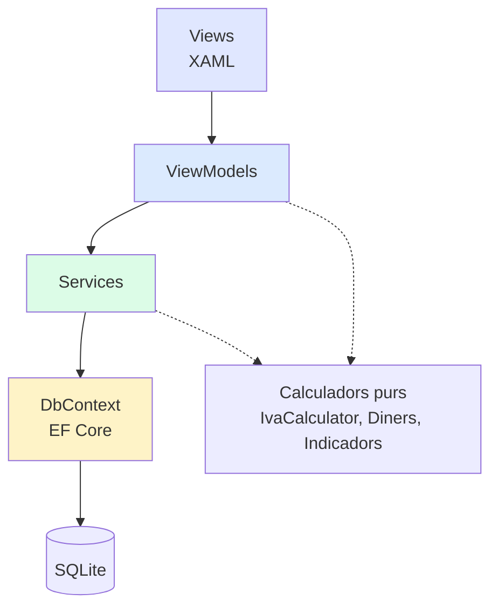

# Capa MVVM: ViewModels, serveis i accés a dades

## 1. Regles de dependència

Qui pot parlar amb qui. Aquesta és la regla que manté el projecte net a mesura que creix.



| Regla | Motiu |
|---|---|
| Les **Views** no coneixen els serveis | Tot passa per binding al ViewModel |
| Els **ViewModels** no coneixen EF Core | No hi ha `DbContext` ni `Include()` en un ViewModel |
| Els **Services** no coneixen la interfície | Cap servei obre un diàleg ni toca un control |
| Els **calculadors** no tenen estat ni dependències | Són estàtics i purs, es poden provar sense res més |

---

## 2. Sobre els repositoris: decisió revisada

Al document d'stack havia apuntat una carpeta `Data/` amb "repositoris". **Ho canvio**, i val la pena explicar per què.

`DbContext` **ja és** un repositori i una unitat de treball: `DbSet<T>` fa el que faria un `IRepository<T>`. Afegir-hi una capa de repositoris genèrics per sobre significa escriure i mantenir centenars de línies que només reenvien crides, i a la pràctica acaba filtrant conceptes d'EF Core igualment (`Include`, `AsNoTracking`).

Per a un projecte d'una persona amb el requisit explícit de "sense sobre-enginyeria" (RNF-Mantenibilitat), la separació que aporta valor real és:

```
ViewModels  →  Services  →  DbContext
```

Els **serveis** són la frontera. Encapsulen les consultes i les regles de negoci, i els ViewModels no veuen mai EF Core. Això dona la testabilitat i la separació que buscàvem, amb una capa menys.

---

## 3. Infraestructura MVVM

### 3.1. CommunityToolkit.Mvvm

Recomano el paquet **`CommunityToolkit.Mvvm`** (oficial de Microsoft). No és una llibreria d'estil visual (que vam descartar), sinó la lampisteria de MVVM: genera `INotifyPropertyChanged` i els comandaments per tu.

Sense el toolkit, cada propietat s'escriu així:

```csharp
private string _nom = string.Empty;
public string Nom
{
    get => _nom;
    set { _nom = value; OnPropertyChanged(); }
}
```

Amb el toolkit:

```csharp
[ObservableProperty]
private string _nom = string.Empty;
```

Multiplicat per unes 150 propietats al projecte sencer, la diferència és gran. I com que és un generador de codi, no hi ha reflexió ni màgia en temps d'execució.

### 3.2. Servei de diàlegs

Els ViewModels no poden obrir finestres directament (trencaria la regla de dependència i faria impossible provar-los). S'injecta una abstracció:

```csharp
namespace Barberia.Services;

/// <summary>Lets ViewModels request dialogs without knowing about WPF windows.</summary>
public interface IDialogService
{
    /// <summary>Opens a modal dialog bound to the given ViewModel.
    /// Returns true when the user confirmed.</summary>
    Task<bool> MostrarDialeg<TViewModel>(TViewModel viewModel) where TViewModel : class;

    /// <summary>Yes/no confirmation. Used for every destructive action (RF-21).</summary>
    Task<bool> Confirmar(string titol, string missatge,
                         string textConfirmar, string textCancellar = "Cancel·lar");

    /// <summary>Informational message with a single OK button.</summary>
    Task Informar(string titol, string missatge);

    /// <summary>Native save-file dialog. Returns null when cancelled.</summary>
    Task<string?> DemanarRutaDesar(string nomSuggerit, string filtre);
}
```

La implementació concreta viu a la capa de UI i és l'única que coneix `Window` i `MessageBox`.

---

## 4. Serveis

### 4.1. Resum

| Servei | Responsabilitat |
|---|---|
| `ClientService` | CRUD de clients, cerca, càlcul de `ClientKey`, unicitat del nom, adormir/despertar/eliminar |
| `CitaService` | CRUD de cites i canvis d'estat |
| `DisponibilitatService` | Càlcul de solapament, horari de la barberia, dies tancats |
| `VendaService` | Crear, editar i anul·lar vendes; construir-les des d'una cita |
| `CaixaService` | Moviments d'entrada/sortida, balanç i desglossament d'IVA per període |
| `CatalegService` | Serveis, productes i mètodes de pagament |
| `TreballadoraService` | Treballadores i els seus horaris; activar/desactivar |
| `InformesService` | Indicadors per client, rànquings i detall per treballadora |
| `ConfiguracioService` | Lectura i escriptura tipada de la taula clau-valor, amb memòria cau |
| `BackupService` | Còpia automàtica i manual, retenció i restauració |
| `ExportService` | Generació del CSV per a l'assessoria |
| `IDialogService` | Obrir diàlegs i confirmacions (implementat a la capa UI) |

Els **calculadors purs** (`IvaCalculator`, `Indicadors`, `Diners`, `Percentatges`) ja estan definits al document de models de domini. No són serveis: són estàtics, sense estat ni accés a dades.

---

### 4.2. `ClientService`

```csharp
public interface IClientService
{
    Task<List<Client>> ObtenirActius();
    Task<List<Client>> ObtenirAdormits();
    Task<List<Client>> Cercar(string text);          // by name or phone
    Task<Client?> ObtenirPerId(int id);

    /// <summary>The existing client with this name, if there is one. A name identifies
    /// a client, so this REFUSES the save rather than warning about it (RF-03).</summary>
    Task<Client?> BuscarPossibleDuplicat(string nom, string mobil);

    Task<int> Crear(Client client);

    /// <summary>Recalculates ClientKey when the name changed.</summary>
    Task Actualitzar(Client client);

    Task Adormir(int clientId);
    Task Despertar(int clientId);

    /// <summary>Physical delete. Cascades to appointments and sales (RF-04).</summary>
    Task Eliminar(int clientId);

    /// <summary>Counts used by the delete confirmation message.</summary>
    Task<(int cites, int vendes)> ComptarHistorial(int clientId);

    /// <summary>Registered clients whose birthday is today (RF-03).</summary>
    Task<List<Client>> AniversarisAvui();
}
```

**Càlcul de `ClientKey`** (decisió 6.1), dins del servei:

```csharp
/// <summary>
/// Builds the identity key: the whole name, normalised. The phone takes no part —
/// "Joan García" is one client whatever number they are on, and "Joan Pérez" on that
/// same number is a different one.
/// </summary>
private static string CalcularClientKey(string nom)
{
    // Strip diacritics, drop every space, lowercase
    string normalitzat = new string(nom.Normalize(NormalizationForm.FormD)
        .Where(c => CharUnicodeInfo.GetUnicodeCategory(c) != UnicodeCategory.NonSpacingMark)
        .ToArray()).ToLowerInvariant();

    return new string(normalitzat.Where(c => !char.IsWhiteSpace(c)).ToArray());
}
```

---

### 4.3. `CitaService`

```csharp
public interface ICitaService
{
    Task<List<Cita>> ObtenirPerDia(DateOnly data);

    /// <summary>Whole range in one query, used by the weekly agenda (RF-02)
    /// so navigating between weeks does not need one round trip per day.</summary>
    Task<List<Cita>> ObtenirPerRang(DateOnly des, DateOnly fins);
    Task<List<Cita>> ObtenirPerClient(int clientId);
    Task<Cita?> ObtenirPerId(int id);

    /// <summary>Completed appointments with no sale yet, for manual association (RF-09).</summary>
    Task<List<Cita>> ObtenirRealitzadesSenseVenda();

    /// <summary>Counts appointments in one state over a range. Used by the dashboard
    /// counters and by the day-scenario tests.</summary>
    Task<int> ComptarPerEstat(DateOnly des, DateOnly fins, EstatCita estat);

    Task<int> Crear(Cita cita);
    Task Actualitzar(Cita cita);

    /// <summary>Changes state. Cancelled and no-show can never carry a sale (RF-02).</summary>
    Task CanviarEstat(int citaId, EstatCita nouEstat);

    Task Eliminar(int citaId);
}
```

---

### 4.4. `DisponibilitatService`

Aïllat en un servei propi perquè és el càlcul menys evident del projecte (decisió 6.7) i el que més cal poder provar.

```csharp
public record ResultatDisponibilitat(
    bool HiHaSolapament,
    bool ForaHorari,
    bool DiaTancat,
    string? MotiuDiaTancat,
    int TreballadoresDisponibles,
    int CitesExistents);

public interface IDisponibilitatService
{
    /// <summary>
    /// Checks an appointment slot. Never blocks: it only reports what the UI should warn about.
    /// Pass citaIdExclosa when editing, so the appointment does not clash with itself.
    /// </summary>
    Task<ResultatDisponibilitat> Comprovar(
        DateOnly data, TimeOnly hora, int duradaMin,
        int? treballadoraId, int? citaIdExclosa = null);

    /// <summary>Active workers whose weekly schedule covers this slot.</summary>
    Task<List<Treballadora>> TreballadoresDisponibles(DateOnly data, TimeOnly hora);

    Task<bool> EsDiaObert(DateOnly data);
    Task<List<(TimeOnly inici, TimeOnly fi)>> FranjesObertura(DateOnly data);

    /// <summary>Closed dates within a range, with their reason. Used by the weekly
    /// agenda to dim whole columns without one query per day.</summary>
    Task<Dictionary<DateOnly, string?>> DiesTancatsA(DateOnly des, DateOnly fins);
}
```

**Lògica del solapament,** tal com es va validar als casos d'ús:

```csharp
// A slot overlaps when it starts before the other ends and ends after the other starts.
// Cancelled and no-show appointments never count: they free up the slot.
bool SeSolapen(TimeOnly iniciA, int duradaA, TimeOnly iniciB, int duradaB)
    => iniciA < iniciB.AddMinutes(duradaB) && iniciA.AddMinutes(duradaA) > iniciB;
```

---

### 4.5. `VendaService`

```csharp
public record FiltreVendes(
    DateOnly? Des = null, DateOnly? Fins = null,
    int? ClientId = null, int? ServeiId = null, int? ProducteId = null,
    int? MetodePagamentId = null, int? TreballadoraId = null,
    EstatVenda? Estat = null);

public interface IVendaService
{
    Task<List<Venda>> Cercar(FiltreVendes filtre);
    Task<Venda?> ObtenirPerId(int id);
    Task<List<Venda>> ObtenirPerClient(int clientId);

    /// <summary>
    /// Creates a sale. Computes the VAT breakdown by grouping lines per rate,
    /// then freezes price, VAT rate and the current VAT mode on the saved rows (6.4).
    /// </summary>
    Task<int> Crear(Venda venda, List<VendaLinia> linies);

    Task Actualitzar(Venda venda, List<VendaLinia> linies);

    /// <summary>Marks the sale as cancelled. Never deletes it (RF-10).</summary>
    Task Anullar(int vendaId);

    /// <summary>Builds an unsaved sale prefilled from an appointment (RF-09).</summary>
    Task<Venda> PreparaDesDeCita(int citaId);
}
```

---

### 4.6. `CaixaService`

```csharp
// Aggregates use long: individual amounts fit in int, but a multi-year sum
// should never depend on turnover staying below int.MaxValue.
public record ResumCaixa(
    long VendesCents,
    long EntradesCents,
    long SortidesCents,
    long BalancCents,
    long BaseCents,
    long IvaCents,
    List<DesglossamentPerTipus> DesglossamentIva);

public interface ICaixaService
{
    Task<List<MovimentCaixa>> ObtenirPerPeriode(DateOnly des, DateOnly fins);

    /// <summary>
    /// Period summary. Cancelled sales are always excluded.
    ///
    /// CANONICAL RULE: totals are summed from the frozen values on Vendes and
    /// VendaDesglossaments. They are NEVER recomputed from VendaLinies: the two
    /// methods disagree, and the gap grows without bound (about 5 EUR of base over
    /// five years of trading). See decision 6.4.
    ///
    /// Sums use long to stay safe regardless of how far back the period reaches.
    /// </summary>
    Task<ResumCaixa> Resum(DateOnly des, DateOnly fins);

    Task<int> Crear(MovimentCaixa moviment);
    Task Actualitzar(MovimentCaixa moviment);
    Task Eliminar(int movimentId);
}
```

Exemple de la consulta correcta:

```csharp
// Cast to long before summing: SQLite SUM is 64-bit, and long avoids any risk of
// overflow on a very long period regardless of turnover.
long baseTotal = await db.Vendes
    .Where(v => v.Estat == EstatVenda.Activa && v.Data >= des && v.Data <= fins)
    .SumAsync(v => (long)v.BaseCents);

// Per-rate breakdown for Modelo 303, straight from the frozen rows
var perTipus = await db.VendaDesglossaments
    .Where(d => d.Venda.Estat == EstatVenda.Activa
             && d.Venda.Data >= des && d.Venda.Data <= fins)
    .GroupBy(d => d.IvaBp)
    .Select(g => new
    {
        IvaBp = g.Key,
        Base = g.Sum(x => (long)x.BaseCents),
        Iva = g.Sum(x => (long)x.IvaCents),
        Total = g.Sum(x => (long)x.TotalCents)
    })
    .ToListAsync();
```

---

### 4.7. `CatalegService`

Serveis, productes i mètodes de pagament. És el CRUD més senzill del projecte i el primer que convé programar, per fixar el patró Vista → ViewModel → Servei.

```csharp
public interface ICatalegService
{
    // --- Serveis ---
    Task<List<Servei>> ObtenirServeis(bool nomesActius = false);
    Task<Servei?> ObtenirServei(int id);
    Task<int> CrearServei(Servei servei);
    Task ActualitzarServei(Servei servei);
    Task CanviarEstatServei(int id, bool actiu);

    // --- Productes ---
    Task<List<Producte>> ObtenirProductes(bool nomesActius = false);
    Task<Producte?> ObtenirProducte(int id);
    Task<int> CrearProducte(Producte producte);
    Task ActualitzarProducte(Producte producte);
    Task CanviarEstatProducte(int id, bool actiu);

    // --- Mètodes de pagament ---
    Task<List<MetodePagament>> ObtenirMetodes(bool nomesActius = false);
    Task<int> CrearMetode(string nom);
    Task ActualitzarMetode(MetodePagament metode);

    /// <summary>
    /// Deactivating the last active payment method would make it impossible to take
    /// money, so the service refuses it and the UI explains why (pantalles 2.5).
    /// </summary>
    Task<bool> PotDesactivarMetode(int id);
    Task CanviarEstatMetode(int id, bool actiu);
}
```

**Nota sobre els elements inactius:** els serveis i productes no s'eliminen mai des de la interfície, només es desactiven. Això manté intactes les línies de venda que hi apunten, que de tota manera ja guarden còpia pròpia del preu i l'IVA.

---

### 4.8. `TreballadoraService`

```csharp
public interface ITreballadoraService
{
    Task<List<Treballadora>> ObtenirTotes(bool nomesActives = false);
    Task<Treballadora?> ObtenirPerId(int id);

    /// <summary>Creates the worker together with her weekly schedule rows.</summary>
    Task<int> Crear(Treballadora treballadora, List<HorariTreballadora> horaris);

    Task Actualitzar(Treballadora treballadora);

    /// <summary>Replaces the whole weekly schedule in one operation, so partial
    /// saves cannot leave a worker with half an old and half a new timetable.</summary>
    Task DesarHoraris(int treballadoraId, List<HorariTreballadora> horaris);

    Task<List<HorariTreballadora>> ObtenirHoraris(int treballadoraId);

    /// <summary>Marks her as away (holidays, sick leave). Reversible, and it does not
    /// touch her schedule or her history (RF-06).</summary>
    Task CanviarEstat(int treballadoraId, bool activa);

    /// <summary>Next free colour from the palette, used when creating a worker.</summary>
    Task<string> SuggerirColor();
}
```

**Les treballadores no s'eliminen.** No hi ha cap mètode `Eliminar`: si algú marxa, es marca com a inactiva i conserva tot el seu historial de vendes, que segueix comptant als totals del període en què va treballar.

---

### 4.9. `InformesService`

```csharp
public record IndicadorsClient(
    int Visites, int Cancellades, int NoAssistides,
    long TotalGastatCents,
    decimal? MitjanaPerVisitaEuros,     // null when no completed visits
    double? FrequenciaDies,             // null with fewer than 2 visits
    DateOnly? PrimeraVisita, DateOnly? UltimaVisita);

public record DetallTreballadora(
    int TreballadoraId, string Nom,
    int VendesAteses, long IngressosCents,
    decimal? PercentatgeTreball,        // null when the period had no sales
    decimal? PercentatgeProductes,      // null when this worker had no sales
    List<(string nom, int vegades)> Serveis,
    List<(string nom, int unitats)> Productes,
    long AltresConceptesCents,
    List<(DiaSetmana dia, int vendes, long ingressosCents)> ActivitatPerDia);

public interface IInformesService
{
    Task<IndicadorsClient> IndicadorsDeClient(int clientId);

    Task<List<(Client client, int visites, long totalCents)>> TopPerVisites(int limit = 10);
    Task<List<(Client client, long totalCents)>> TopPerDespesa(int limit = 10);
    Task<List<(Client client, decimal mitjanaEuros)>> TopPerMitjana(int limit = 10);
    Task<List<(Client client, DateOnly ultima, int diesSense)>> FaTempsQueNoVenen(int limit = 10);

    Task<DetallTreballadora> DetallDeTreballadora(int treballadoraId, DateOnly des, DateOnly fins);
    Task<List<DetallTreballadora>> RanquingTreballadores(DateOnly des, DateOnly fins);

    Task<List<(int any, int mes, long totalCents)>> EvolucioMensual(int mesos = 12);
    Task<(Client client, int visites, long totalCents)?> ClientDelMes();
}
```

**Nota:** els camps `decimal?` i `double?` són nul·lables a propòsit. Quan són `null`, la interfície mostra `—`, mai `0 %` (RF-17).

---

### 4.10. `ConfiguracioService`

La taula és clau-valor amb tot en text, però els ViewModels han de rebre tipus reals. El servei fa la conversió i manté una memòria cau, perquè aquests valors es llegeixen constantment.

```csharp
public interface IConfiguracioService
{
    Task Carregar();                    // loads everything into cache at startup

    int IvaBpDefecte { get; }
    IvaMode ModeIva { get; }
    bool AplicarIvaCaixa { get; }
    int DuradaDefecteCitaMin { get; }
    TimeOnly HoraBackup { get; }
    int BackupsAConservar { get; }
    bool MostrarAvisConvidat { get; }
    bool SoConfirmacio { get; }
    string BarberiaNom { get; }
    string BarberiaAdreca { get; }
    string BarberiaTelefon { get; }

    /// <summary>Date of the last automatic backup, so the app can tell whether today's
    /// is still due. Null on a database that has never run one.</summary>
    DateOnly? UltimaCopiaAutomatica { get; }

    Task Desar(string clau, string valor);
    Task DesarMolts(Dictionary<string, string> valors);

    /// <summary>Seeds default values on first run (see schema 2.13).</summary>
    Task SeedInicial();
}
```

---

### 4.11. `BackupService`

```csharp
public record CopiaSeguretat(string Ruta, DateTime Data, bool EsAutomatica, long BytesMida);

public interface IBackupService
{
    Task<List<CopiaSeguretat>> Llistar();

    Task<CopiaSeguretat> FerCopiaManual();

    /// <summary>
    /// Runs the daily backup if it is due. Called at startup and by the timer, because
    /// the machine may have been off at the configured hour (CU-11).
    /// </summary>
    Task<CopiaSeguretat?> FerCopiaAutomaticaSiCal();

    /// <summary>Deletes the oldest backups beyond the configured retention.</summary>
    Task NetejarAntigues();

    /// <summary>
    /// Restores a backup. Always backs up the CURRENT state first, so an accidental
    /// restore can still be undone (CU-09b).
    /// </summary>
    Task Restaurar(string rutaCopia);
}
```

---

### 4.12. `ExportService`

```csharp
public interface IExportService
{
    /// <summary>
    /// Writes two CSV files for the period: one row per SALE, and one row per VAT rate.
    ///
    /// Not one row per line: base and quota only exist per sale and per rate. Splitting
    /// a sale's base across its lines requires rounding and the parts do not add back
    /// up, so the export would not match what the app shows (6.8).
    /// </summary>
    Task ExportarVendes(DateOnly des, DateOnly fins, string carpetaDesti);
}
```

---

## 5. ViewModels

### 5.1. Resum

**Un per pàgina:**

| ViewModel | Pantalla |
|---|---|
| `MainWindowViewModel` | Contenidor: navegació lateral i pàgina activa |
| `IniciViewModel` | Inici |
| `AgendaViewModel` | Agenda |
| `ClientsViewModel` | Clients |
| `TreballadoresViewModel` | Treballadores |
| `CatalegViewModel` | Serveis i productes |
| `VendesViewModel` | Vendes |
| `CaixaViewModel` | Caixa |
| `InformesViewModel` | Informes |
| `ConfiguracioViewModel` | Configuració |

**Un per diàleg:**

| ViewModel | Diàleg |
|---|---|
| `CitaDialogViewModel` | Cita (nova / editar) |
| `VendaDialogViewModel` | Venda (nova / des de cita / editar) |
| `ClientDialogViewModel` | Client (nou / editar) |
| `FitxaClientViewModel` | Fitxa del client |
| `MovimentDialogViewModel` | Entrada / sortida de caixa |
| `ServeiDialogViewModel` | Servei |
| `ProducteDialogViewModel` | Producte |
| `MetodePagamentDialogViewModel` | Mètode de pagament |
| `TreballadoraDialogViewModel` | Treballadora i el seu horari |
| `ExportDialogViewModel` | Exportar període |
| `RestaurarDialogViewModel` | Restaurar còpia |
| `AjudaViewModel` | Ajuda (FAQ) |

**Un d'element** (files dins d'una col·lecció):

| ViewModel | Ús |
|---|---|
| `VendaLiniaViewModel` | Fila editable dins del diàleg de venda |
| `DiaAgendaViewModel` | Columna d'un dia dins de la graella setmanal de l'agenda |
| `CitaFilaViewModel` | Fila de cita amb els seus comandaments d'estat |
| `HorariFranjaViewModel` | Franja horària dins del diàleg de treballadora |

---

### 5.2. `MainWindowViewModel`

```csharp
public partial class MainWindowViewModel : ObservableObject
{
    [ObservableProperty] private ObservableObject? _paginaActual;
    [ObservableProperty] private string _paginaActivaNom = "Inici";

    // One command per navigation entry; each resolves its ViewModel from DI
    [RelayCommand] private void NavegarInici() => ...
    [RelayCommand] private void NavegarAgenda() => ...
    // ... one per page

    [RelayCommand] private Task ObrirAjuda() => ...
}
```

---

### 5.3. `AgendaViewModel`

Manté una setmana carregada alhora, no un dia. Canviar de setmana substitueix les 7 col·leccions; seleccionar un dia només canvia quin detall es mostra, sense tornar a consultar la base de dades.

```csharp
public partial class AgendaViewModel : ObservableObject
{
    [ObservableProperty] private DateOnly _inicSetmana;   // always a Monday
    [ObservableProperty] private string _rangText = string.Empty;   // "7 – 11 de setembre 2026"
    [ObservableProperty] private DiaAgendaViewModel? _diaSeleccionat;
    [ObservableProperty] private bool _carregant;

    /// <summary>One entry per day of the week, Monday to Sunday, always 7 items.</summary>
    public ObservableCollection<DiaAgendaViewModel> Dies { get; } = [];

    [RelayCommand] private async Task SetmanaAnterior()
        => await CarregarSetmana(InicSetmana.AddDays(-7));

    [RelayCommand] private async Task SetmanaSeguent()
        => await CarregarSetmana(InicSetmana.AddDays(7));

    [RelayCommand] private async Task AquestaSetmana()
        => await CarregarSetmana(DilluIrsDeLaSetmana(DateOnly.FromDateTime(DateTime.Today)));

    [RelayCommand] private void SeleccionarDia(DiaAgendaViewModel dia)
        => DiaSeleccionat = dia;

    /// <summary>
    /// Loads all seven days of the week in one round trip, then distributes the
    /// appointments client-side. One query per week, not one per day.
    /// </summary>
    private async Task CarregarSetmana(DateOnly dilluns)
    {
        Carregant = true;
        try
        {
            InicSetmana = dilluns;
            var diumenge = dilluns.AddDays(6);
            RangText = FormatarRang(dilluns, diumenge);

            var totes = await _cites.ObtenirPerRang(dilluns, diumenge);
            var tancats = await _disponibilitat.DiesTancatsA(dilluns, diumenge);

            Dies.Clear();
            for (int i = 0; i < 7; i++)
            {
                var data = dilluns.AddDays(i);
                Dies.Add(new DiaAgendaViewModel
                {
                    Data = data,
                    EsAvui = data == DateOnly.FromDateTime(DateTime.Today),
                    Tancat = tancats.TryGetValue(data, out var motiu),
                    MotiuTancat = tancats.GetValueOrDefault(data),
                    Cites = new(totes.Where(c => c.Data == data).OrderBy(c => c.Hora))
                });
            }
            DiaSeleccionat ??= Dies.FirstOrDefault(d => d.EsAvui) ?? Dies[0];
        }
        finally { Carregant = false; }
    }

    private static DateOnly DilluIrsDeLaSetmana(DateOnly data)
    {
        int offset = ((int)data.DayOfWeek + 6) % 7;   // Monday = 0, ..., Sunday = 6
        return data.AddDays(-offset);
    }
}

/// <summary>One column of the weekly grid.</summary>
public partial class DiaAgendaViewModel : ObservableObject
{
    public DateOnly Data { get; init; }
    public bool EsAvui { get; init; }
    public bool Tancat { get; init; }
    public string? MotiuTancat { get; init; }
    public ObservableCollection<Cita> Cites { get; init; } = [];
}
```

**Per què una consulta per setmana i no set consultes diàries:** `ICitaService.ObtenirPerRang` es demana un sol cop en canviar de setmana; les 7 columnes es reparteixen en memòria. Estalvia 6 anades i tornades a la base de dades cada vegada que es navega.

---

### 5.4. `VendaDialogViewModel`

El més complex, i el que fa servir la mateixa classe per als tres modes (RF-09).

```csharp
public partial class VendaDialogViewModel : ObservableObject
{
    public enum Mode { Nova, DesDeCita, Editar }

    [ObservableProperty] private string _titol = "Nova venda";
    [ObservableProperty] private Mode _modeActual = Mode.Nova;

    // Client: registered or guest
    [ObservableProperty] private Client? _clientSeleccionat;
    [ObservableProperty] private string _textClient = string.Empty;
    [ObservableProperty] private string? _telefonConvidat;
    [ObservableProperty] private bool _mostrarAvisConvidat;

    [ObservableProperty] private Treballadora? _treballadora;
    [ObservableProperty] private MetodePagament? _metodePagament;
    [ObservableProperty] private Cita? _citaAssociada;
    [ObservableProperty] private string? _observacions;

    /// <summary>Editable lines. Any change recomputes the totals.</summary>
    public ObservableCollection<VendaLiniaViewModel> Linies { get; } = [];

    // Live totals, recomputed by RecalcularTotals()
    [ObservableProperty] private int _baseCents;
    [ObservableProperty] private int _ivaCents;
    [ObservableProperty] private int _totalCents;
    [ObservableProperty] private List<DesglossamentPerTipus> _desglossament = [];

    [RelayCommand] private void AfegirServei() => ...
    [RelayCommand] private void AfegirProducte() => ...
    [RelayCommand] private void AfegirConceptePersonalitzat() => ...
    [RelayCommand] private void TreureLinia(VendaLiniaViewModel linia) => ...

    [RelayCommand(CanExecute = nameof(PotCobrar))] private Task Cobrar() => ...
    [RelayCommand] private Task AnullarVenda() => ...
    [RelayCommand] private Task RegistrarClientConvidat() => ...

    /// <summary>At least one line, a payment method, and a client (registered or guest).</summary>
    private bool PotCobrar() =>
        Linies.Count > 0
        && MetodePagament is not null
        && (ClientSeleccionat is not null || !string.IsNullOrWhiteSpace(TextClient));

    /// <summary>Recomputes the breakdown whenever a line changes. Grouping per VAT rate
    /// is what keeps base + iva == total exact (6.4).</summary>
    private void RecalcularTotals()
    {
        var linies = Linies.Select(l => l.AModel()).ToList();
        var d = IvaCalculator.Calcular(linies, _configuracio.ModeIva);
        BaseCents = d.BaseCents;
        IvaCents = d.IvaCents;
        TotalCents = d.TotalCents;
        Desglossament = IvaCalculator.CalcularPerTipus(linies, _configuracio.ModeIva);
    }
}
```

---

### 5.5. `VendaLiniaViewModel`

Fila editable. El seu paper és permetre modificar qualsevol línia, vingui del catàleg o no, tal com exigeix RF-09.

```csharp
public partial class VendaLiniaViewModel : ObservableObject
{
    // Catalogue origin, kept only for reporting. Never the source of price or VAT.
    public int? ServeiId { get; init; }
    public int? ProducteId { get; init; }

    [ObservableProperty] private string _descripcio = string.Empty;
    [ObservableProperty] private int _quantitat = 1;
    [ObservableProperty] private string _preuText = "0,00";   // bound to a text box
    [ObservableProperty] private int _ivaBp;

    /// <summary>Raised so the parent dialog can recompute the sale totals.</summary>
    public event Action? Canviada;

    [ObservableProperty] private int _importCents;

    /// <summary>Parses the typed price into cents and updates the line total.</summary>
    private void Recalcular()
    {
        if (!Diners.TryParse(PreuText, out int preuCents)) preuCents = 0;
        ImportCents = preuCents * Quantitat;
        Canviada?.Invoke();
    }

    public VendaLinia AModel() => new()
    {
        ServeiId = ServeiId,
        ProducteId = ProducteId,
        Descripcio = Descripcio,
        Quantitat = Quantitat,
        PreuUnitariCents = Diners.TryParse(PreuText, out int p) ? p : 0,
        IvaBp = IvaBp,
        ImportCents = ImportCents
    };
}
```

---

### 5.6. `CitaDialogViewModel`

El que té d'especial: els avisos es recalculen mentre l'usuària escriu, i **cap d'ells bloqueja** el desat.

```csharp
public partial class CitaDialogViewModel : ObservableObject
{
    [ObservableProperty] private DateOnly _data;
    [ObservableProperty] private TimeOnly _hora;
    [ObservableProperty] private int _duradaMin;
    [ObservableProperty] private Servei? _servei;
    [ObservableProperty] private Treballadora? _treballadora;

    // Non-blocking inline warnings (see pantalles 3.1)
    [ObservableProperty] private bool _avisSolapament;
    [ObservableProperty] private bool _avisForaHorari;
    [ObservableProperty] private bool _avisDiaTancat;
    [ObservableProperty] private string? _motiuDiaTancat;
    [ObservableProperty] private bool _avisClientConvidat;

    /// <summary>Called whenever date, time, duration or worker change.</summary>
    private async Task RevisarAvisos()
    {
        var r = await _disponibilitat.Comprovar(Data, Hora, DuradaMin,
                                                Treballadora?.Id, _citaIdEditant);
        AvisSolapament = r.HiHaSolapament;
        AvisForaHorari = r.ForaHorari;
        AvisDiaTancat = r.DiaTancat;
        MotiuDiaTancat = r.MotiuDiaTancat;
    }

    /// <summary>When a service is picked, its duration prefills the field (RF-02).</summary>
    partial void OnServeiChanged(Servei? value)
        => DuradaMin = value?.DuradaMin ?? _configuracio.DuradaDefecteCitaMin;
}
```

---

## 6. Accés a dades

### 6.1. `BarberiaDbContext`

```csharp
public class BarberiaDbContext : DbContext
{
    public DbSet<Client> Clients => Set<Client>();
    public DbSet<Treballadora> Treballadores => Set<Treballadora>();
    public DbSet<HorariTreballadora> HorarisTreballadora => Set<HorariTreballadora>();
    public DbSet<Servei> Serveis => Set<Servei>();
    public DbSet<Producte> Productes => Set<Producte>();
    public DbSet<MetodePagament> MetodesPagament => Set<MetodePagament>();
    public DbSet<Cita> Cites => Set<Cita>();
    public DbSet<Venda> Vendes => Set<Venda>();
    public DbSet<VendaLinia> VendaLinies => Set<VendaLinia>();
    public DbSet<VendaDesglossament> VendaDesglossaments => Set<VendaDesglossament>();
    public DbSet<MovimentCaixa> MovimentsCaixa => Set<MovimentCaixa>();
    public DbSet<HorariBarberia> HorariBarberia => Set<HorariBarberia>();
    public DbSet<DiaTancat> DiesTancats => Set<DiaTancat>();
    public DbSet<ConfiguracioItem> Configuracio => Set<ConfiguracioItem>();

    protected override void OnModelCreating(ModelBuilder b)
    {
        // Enums are stored as text so the database stays readable and is not
        // broken by reordering the enum members later.
        b.Entity<Cita>().Property(e => e.Estat).HasConversion<string>();
        b.Entity<Venda>().Property(e => e.Estat).HasConversion<string>();
        b.Entity<Venda>().Property(e => e.IvaMode).HasConversion<string>();
        b.Entity<MovimentCaixa>().Property(e => e.Tipus).HasConversion<string>();
        b.Entity<HorariTreballadora>().Property(e => e.DiaSetmana).HasConversion<string>();
        b.Entity<HorariBarberia>().Property(e => e.DiaSetmana).HasConversion<string>();

        // Unique indexes
        b.Entity<Client>().HasIndex(e => e.ClientKey).IsUnique();
        b.Entity<MetodePagament>().HasIndex(e => e.Nom).IsUnique();
        b.Entity<DiaTancat>().HasIndex(e => e.Data).IsUnique();
        b.Entity<Venda>().HasIndex(e => e.CitaId).IsUnique();

        // Query indexes
        b.Entity<Cita>().HasIndex(e => new { e.Data, e.Hora });
        b.Entity<Venda>().HasIndex(e => e.Data);
        b.Entity<Venda>().HasIndex(e => e.Estat);
        b.Entity<MovimentCaixa>().HasIndex(e => e.Data);
        b.Entity<VendaDesglossament>().HasIndex(e => e.VendaId);

        // Deleting a client wipes their history; catalogue items are only deactivated,
        // so their references are nulled rather than cascaded (schema section 4).
        b.Entity<Cita>().HasOne(e => e.Client).WithMany(c => c.Cites)
            .OnDelete(DeleteBehavior.Cascade);
        b.Entity<Venda>().HasOne(e => e.Client).WithMany(c => c.Vendes)
            .OnDelete(DeleteBehavior.Cascade);
        b.Entity<VendaLinia>().HasOne(e => e.Venda).WithMany(v => v.Linies)
            .OnDelete(DeleteBehavior.Cascade);
        b.Entity<VendaDesglossament>().HasOne(e => e.Venda).WithMany(v => v.Desglossaments)
            .OnDelete(DeleteBehavior.Cascade);
        b.Entity<Cita>().HasOne(e => e.Servei).WithMany()
            .OnDelete(DeleteBehavior.SetNull);
        b.Entity<Cita>().HasOne(e => e.Treballadora).WithMany(t => t.Cites)
            .OnDelete(DeleteBehavior.SetNull);
        b.Entity<Venda>().HasOne(e => e.Cita).WithOne(c => c.Venda)
            .OnDelete(DeleteBehavior.SetNull);

        b.Entity<ConfiguracioItem>().HasKey(e => e.Clau);
    }
}
```

### 6.2. Cicle de vida del `DbContext`

Un `DbContext` de vida llarga en una aplicació d'escriptori acaba amb entitats rastrejades obsoletes i errors difícils de diagnosticar. La pauta correcta és **una instància curta per operació**, creada des d'una fàbrica:

```csharp
// Registration
services.AddDbContextFactory<BarberiaDbContext>(opt =>
    opt.UseSqlite($"Data Source={rutaBd}"));

// Usage inside a service
public async Task<List<Client>> ObtenirActius()
{
    await using var db = await _factory.CreateDbContextAsync();
    return await db.Clients
        .Where(c => !c.Adormit)
        .OrderBy(c => c.Nom)
        .AsNoTracking()          // read-only query: no change tracking needed
        .ToListAsync();
}
```

`AsNoTracking()` a totes les consultes de només lectura: la major part de la interfície només mostra dades.

---

## 7. Injecció de dependències

```csharp
// App.xaml.cs
private static IServiceProvider Configurar(string rutaBd)
{
    var services = new ServiceCollection();

    services.AddDbContextFactory<BarberiaDbContext>(o => o.UseSqlite($"Data Source={rutaBd}"));

    // Configuration is a singleton because it caches values read constantly
    services.AddSingleton<IConfiguracioService, ConfiguracioService>();

    services.AddSingleton<IDialogService, DialogService>();
    services.AddSingleton<IBackupService, BackupService>();

    services.AddTransient<IClientService, ClientService>();
    services.AddTransient<ICitaService, CitaService>();
    services.AddTransient<IDisponibilitatService, DisponibilitatService>();
    services.AddTransient<IVendaService, VendaService>();
    services.AddTransient<ICaixaService, CaixaService>();
    services.AddTransient<ICatalegService, CatalegService>();
    services.AddTransient<ITreballadoraService, TreballadoraService>();
    services.AddTransient<IInformesService, InformesService>();
    services.AddTransient<IExportService, ExportService>();

    services.AddSingleton<MainWindowViewModel>();

    // Page ViewModels are transient so each visit starts with fresh data
    services.AddTransient<IniciViewModel>();
    services.AddTransient<AgendaViewModel>();
    // ... one per page and per dialog

    return services.BuildServiceProvider();
}
```

---

## 8. Asincronia i fils

| Regla | Motiu |
|---|---|
| Tots els mètodes de servei són `async` | Cap consulta ha de bloquejar el fil de la interfície |
| Mètodes `...Async` d'EF Core sempre | `ToListAsync`, `FirstOrDefaultAsync`, `SaveChangesAsync` |
| Càrrega inicial de cada pàgina en un mètode `Carregar()` | Es crida des del ViewModel, no des del constructor: un constructor no pot ser `async` |
| Cap `.Result` ni `.Wait()` | Provoquen blocatges mutus en aplicacions amb interfície |
| Propietat `Carregant` per pàgina | Permet mostrar un indicador i deshabilitar botons mentre es consulta |

---

## 9. Estructura de carpetes final

Actualitza la del document d'stack, ja que hem eliminat els repositoris.

```
BarberiaApp/
├── Models/              # Entitats i enums
├── ViewModels/
│   ├── Pagines/         # Un per pantalla
│   ├── Dialegs/         # Un per diàleg
│   └── Elements/        # VendaLinia, CitaFila, HorariFranja
├── Views/
│   ├── Pagines/         # XAML de cada pantalla
│   └── Dialegs/         # XAML de cada diàleg
├── Services/            # Serveis de negoci i calculadors purs
├── Data/                # BarberiaDbContext i migracions
├── Helpers/             # Convertidors de binding, utilitats
├── Resources/           # ResourceDictionary d'estils, sons
└── appsettings.json     # Només la ruta de la base de dades
```

---

## 10. Què val la pena provar amb tests unitaris

Aquests són els punts que trencarien la comptabilitat sense avisar. El catàleg complet de 154 proves és a `pla-proves.md`:

| Prova | Per què |
|---|---|
| `IvaCalculator`: invariant `base + iva == total` | És la garantia que l'IVA trimestral quadra |
| `IvaCalculator`: agrupació amb tipus mixtos | El cas del descuadre d'1 cèntim |
| `IvaCalculator`: casos límit 0 €, 1 cèntim, IVA 0% | Verificats correctes, però convé fixar-los |
| **Suma d'un període == suma dels valors guardats** | La regla canònica de 6.4. Si algú un dia recalcula des de les línies, aquesta prova ho detecta |
| `Vendes.BaseCents == Σ Desglossaments.BaseCents` | Invariant de consistència entre les dues taules |
| `Indicadors`: els quatre casos de divisió per zero | Han de tornar `null`, no petar ni tornar `0` |
| `ClientService.CalcularClientKey`: variants del nom | "Joán García" i "joan  garcia" han de donar la mateixa clau; "Joan Pérez", una de diferent |
| `Diners.TryParse`: "15", "15,50", "15.50", "1.234,56" | El separador de milers va trencar la primera versió |
| `DisponibilitatService`: els 6 casos límit dels casos d'ús | La lògica menys evident del projecte |

---

## 11. Documentació relacionada

- Colors, tipografia i estils: `disseny-ui.md`
- Muntatge del projecte: `setup-projecte.md`
