# Casos d'ús

Fluxos clau de l'aplicació. Serveixen per validar que la lògica és completa abans d'escriure codi, i com a referència en implementar cada servei.

---

## 1. Visió general d'actors i casos

Hi ha un únic actor humà (l'usuària), més dos processos automàtics del sistema.

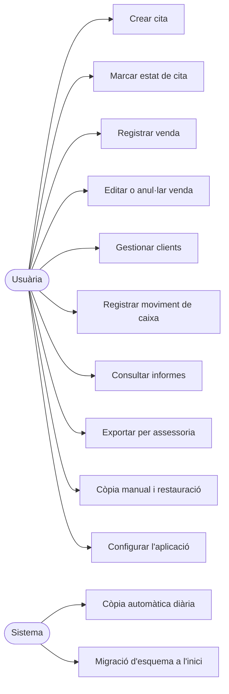

---

## 2. CU-01 · Crear una cita

El punt delicat és que **cap avís bloqueja**: sempre es pot guardar. L'aplicació informa, no impedeix.

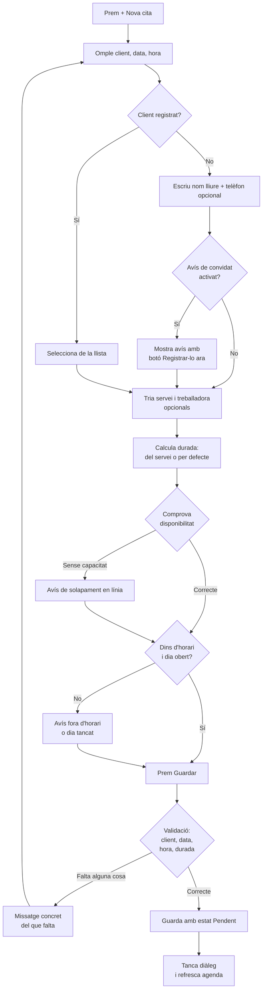

---

## 3. CU-01b · Càlcul del solapament

Detall de la comprovació de disponibilitat (decisió 6.7). És el càlcul menys evident de tota l'aplicació.

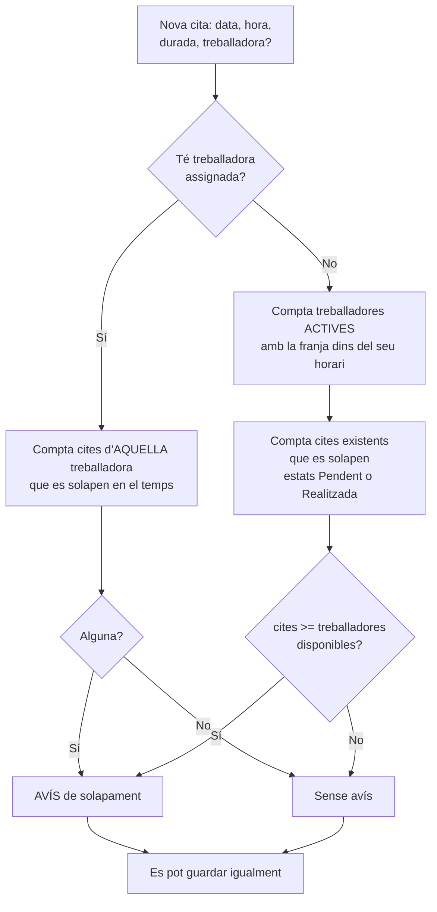

**Casos límit verificats:**

| Situació | Treballadores disponibles | Cites existents | Resultat |
|---|---|---|---|
| Una treballadora, cap cita a les 10:00 | 1 | 0 | Sense avís |
| Una treballadora, ja hi ha cita a les 10:00 | 1 | 1 | Avís |
| Dues treballadores, una cita a les 10:00 | 2 | 1 | Sense avís |
| Dues treballadores, dues cites a les 10:00 | 2 | 2 | Avís |
| Una de vacances (inactiva), una cita | 1 | 1 | Avís |
| Cita cancel·lada a la mateixa hora | 1 | 0 | Sense avís (no compta) |

---

## 4. CU-02 · Marcar l'estat d'una cita

Aquí es connecten agenda i vendes: només *Realitzada* obre el cobrament.

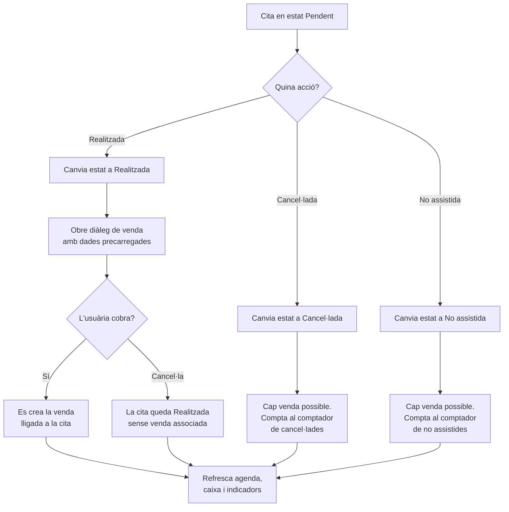

**Nota sobre el camí `G`:** si l'usuària tanca el diàleg de venda sense cobrar, la cita es queda com a *Realitzada* però sense venda. És un estat vàlid (el client va venir però encara no s'ha cobrat) i es podrà cobrar més tard associant la cita a una venda nova.

---

## 5. CU-03 · Registrar una venda

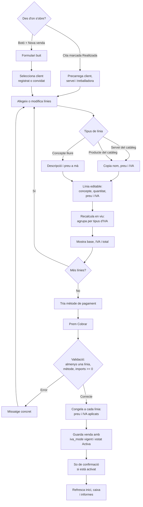

---

## 6. CU-03b · Desglossament d'IVA

El càlcul que garanteix que l'IVA trimestral quadri amb la suma de tiquets.

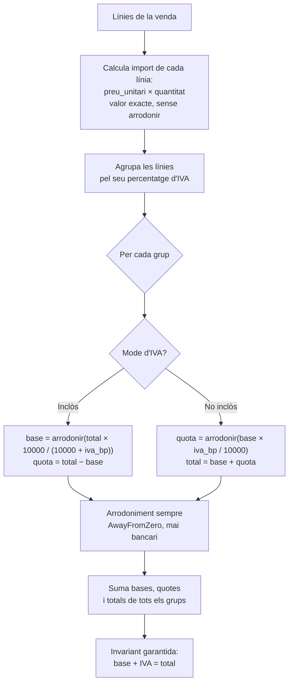

**Per què agrupar i no calcular línia a línia:** amb 3 línies de 10,00 € al 21% inclòs, calcular per línia i sumar dona base 2478, mentre que calcular-ho sobre el total dona 2479. Un cèntim de descuadre per venda faria que la declaració trimestral no quadrés.

---

## 7. CU-04 · Editar o anul·lar una venda

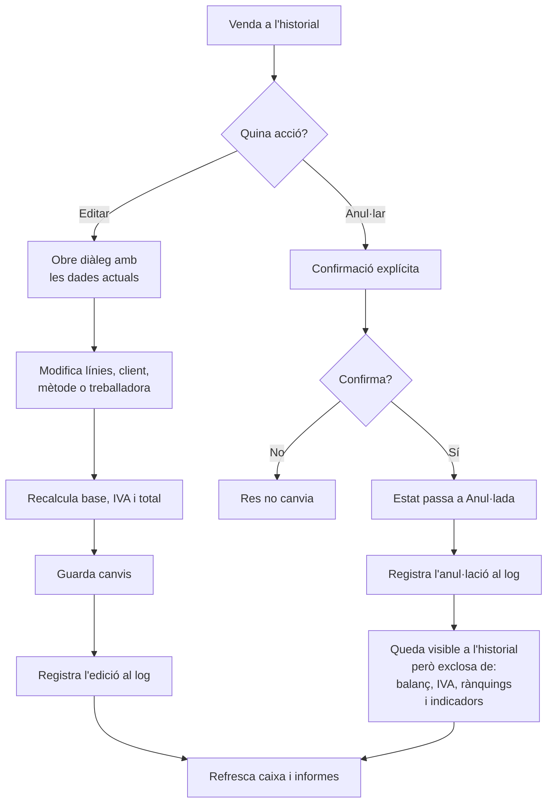

**Per què no s'esborra:** una venda esborrada desapareixeria sense deixar rastre i faria impossible auditar per què un període no quadra. Anul·lant-la, es veu què va passar.

---

## 8. CU-05 · Eliminar o adormir un client

Els dos camins són molt diferents i cal que l'usuària entengui la diferència abans de decidir.

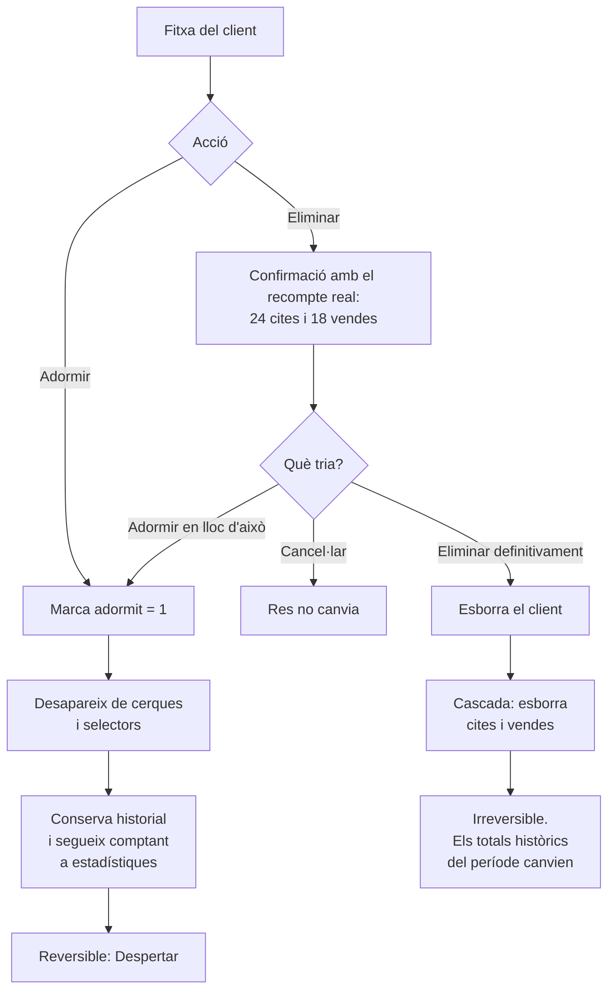

**Decisió de disseny:** la confirmació d'eliminació ofereix *Adormir* com a tercera opció. Qui vol "treure'l de la llista" gairebé sempre vol adormir-lo, no destruir la comptabilitat.

---

## 9. CU-06 · Registrar un moviment de caixa

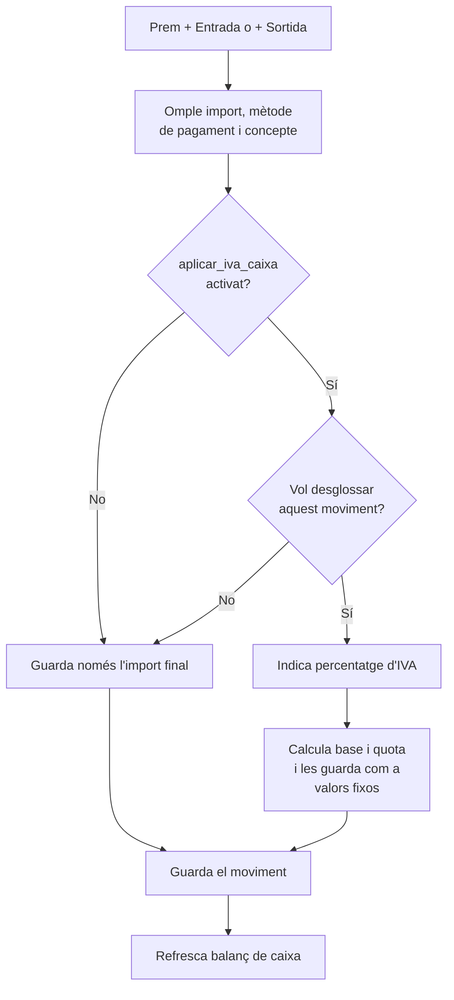

**Per què es guarden base i quota, i no es deriven:** si es calculessin al vol i més tard es canviés la configuració d'IVA, els moviments antics canviarien de valor retroactivament.

---

## 10. CU-07 · Consultar informes per treballadora

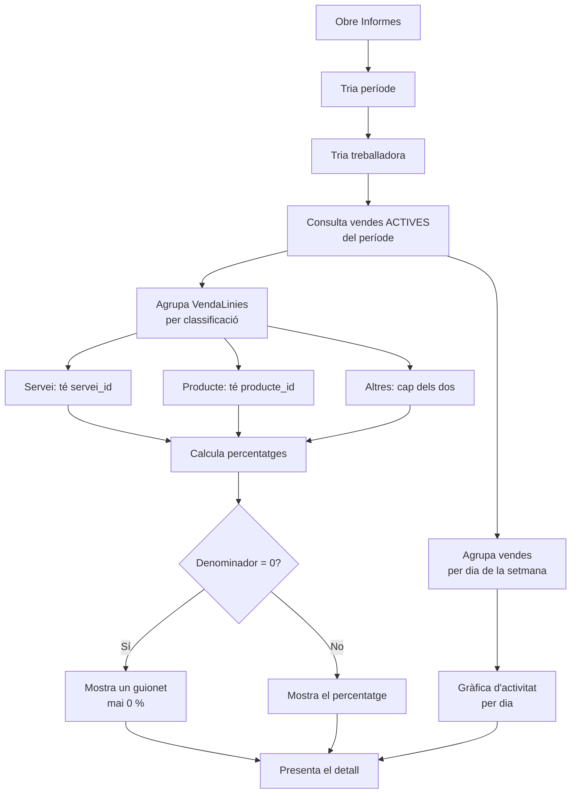

**Els quatre indicadors que poden no tenir valor:**

| Indicador | Sense valor quan |
|---|---|
| % de treball realitzat | El període no té cap venda |
| % de venda de productes | La treballadora no té vendes al període |
| Mitjana per visita | El client no té cap visita realitzada |
| Freqüència de visita | El client té menys de 2 visites realitzades |

---

## 11. CU-08 · Exportar per a l'assessoria

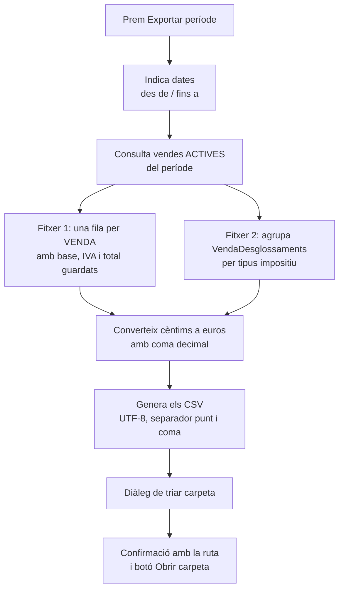

**`vendes_<periode>.csv`:** data · hora · client · treballadora · conceptes · mètode de pagament · base · IVA · total

**`iva_<periode>.csv`:** tipus d'IVA · base · quota · total

**Per què no una fila per línia:** la base només existeix per venda i per tipus impositiu. Repartir-la entre les línies obliga a arrodonir i les parts no sumen el total, així que el fitxer no quadraria amb el que mostra l'aplicació.

---

## 12. CU-09 i CU-11 · Còpies de seguretat

```mermaid
flowchart TD
    subgraph auto[CU-11 · Automàtica]
        A1[Arriba l'hora configurada] --> A2{L'app està oberta?}
        A2 -->|No| A3[Es farà en el<br/>següent arrencada]
        A2 -->|Sí| A4[Copia el fitxer .db]
        A3 --> A4
        A4 --> A5[Compta còpies existents]
        A5 --> A6{Supera el màxim<br/>configurat?}
        A6 -->|Sí| A7[Esborra les més antigues]
        A6 -->|No| A8[Fet]
        A7 --> A8
    end

    subgraph manual[CU-09 · Manual]
        B1[Prem Fer còpia ara] --> B2[Copia el fitxer .db]
        B2 --> B3[Confirmació visual<br/>amb data i hora]
    end

    subgraph rest[CU-09b · Restauració]
        C1[Prem Restaurar còpia] --> C2[Llista còpies<br/>disponibles]
        C2 --> C3[Tria una]
        C3 --> C4[Confirmació amb avís<br/>de pèrdua de dades]
        C4 --> C5{Confirma?}
        C5 -->|No| C6[Res no canvia]
        C5 -->|Sí| C7[Còpia de seguretat<br/>de l'estat ACTUAL]
        C7 --> C8[Substitueix la base de dades]
        C8 --> C9[Reinicia l'aplicació]
    end
```

**Detall important del pas `C7`:** abans de restaurar es fa una còpia de l'estat actual. Si algú restaura per error una còpia antiga, encara pot tornar enrere.

---

## 13. CU-10 · Canviar el mode d'IVA

Cas d'ús petit però amb conseqüències grans, per això es documenta a part.

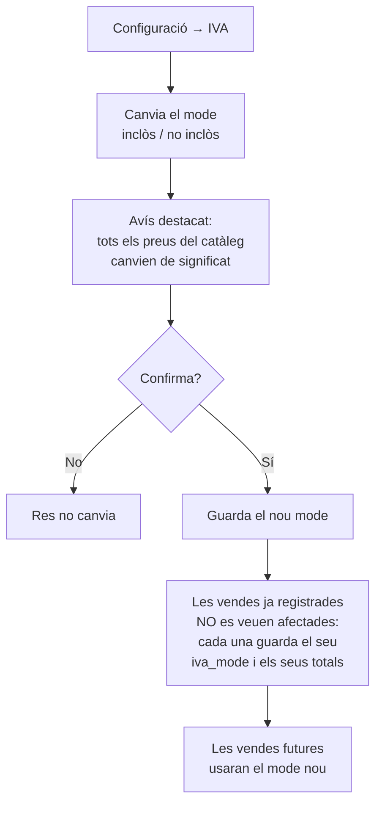

---

## 14. CU-12 · Arrencada de l'aplicació

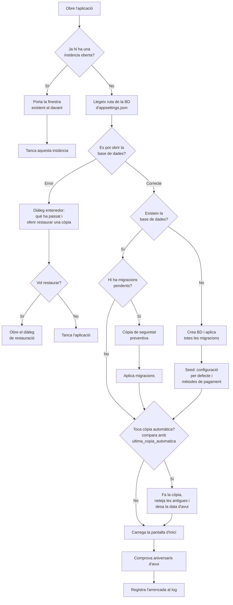

### Una sola instància alhora

Dues instàncies sobre el mateix fitxer SQLite poden xocar en escriure, i les dues intentarien fer la còpia automàtica. S'evita amb un `Mutex` amb nom:

```csharp
// A named mutex keeps a second instance from touching the same SQLite file.
// If one is already running, bring its window forward instead of opening another.
private static Mutex? _instancia;

private static bool EsPrimeraInstancia()
{
    _instancia = new Mutex(initiallyOwned: true, "BarberiaApp.UnicaInstancia", out bool nova);
    return nova;
}
```

### Base de dades inaccessible

Si el fitxer està corrupte, bloquejat per un altre procés o en una ruta que ja no existeix, l'aplicació **no ha de mostrar l'excepció**. Mostra un missatge en llenguatge planer i ofereix la sortida:

> **No s'han pogut obrir les dades.**
>
> El fitxer de dades no es pot llegir. Pot ser que estigui malmès o que s'hagi mogut de lloc.
>
> Tens còpies de seguretat disponibles i pots recuperar-ne una.
>
> `Tancar` | `Restaurar una còpia`

L'error tècnic complet es registra al log, no a la pantalla (RF-18).

### Tancar amb feina a mitges

Tots els formularis són **diàlegs modals**, així que mentre n'hi hagi un obert la finestra principal no es pot tancar. No cal cap comprovació addicional de dades sense desar: o bé s'ha premut `Guardar`, o bé no hi ha res guardat.

---

## 15. Documentació completa

Tots els documents de disseny estan fets. Vegeu `capa-mvvm.md`, `disseny-ui.md` i `setup-projecte.md`.
