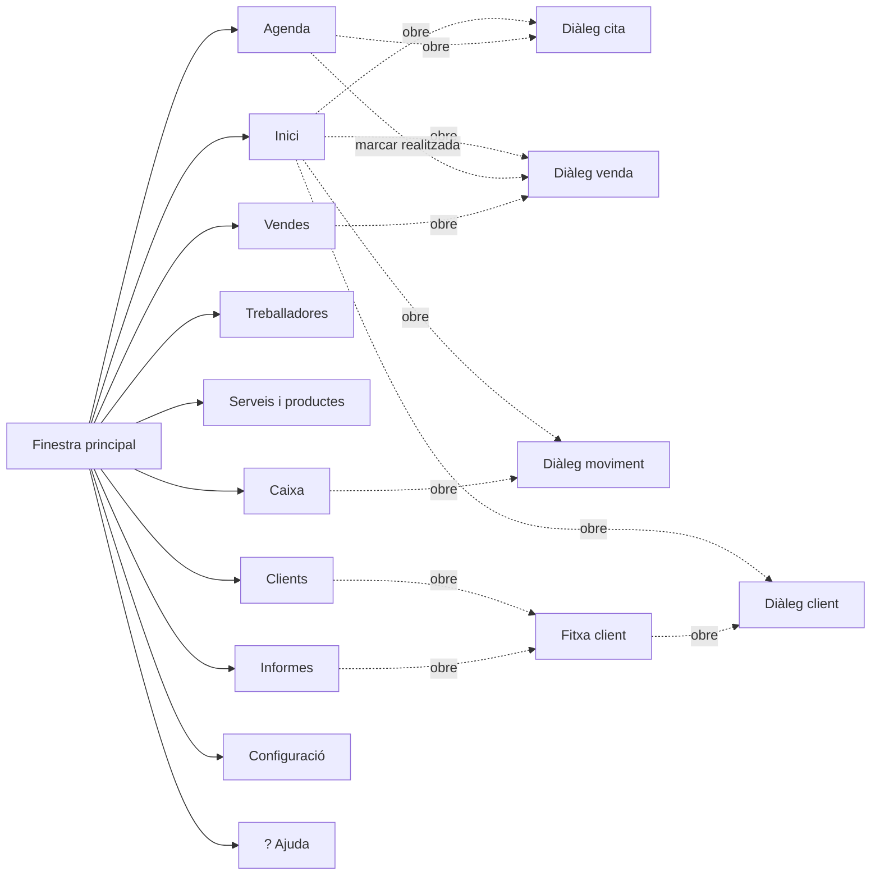

# Definició de pantalles

## 1. Estructura general

L'aplicació té una **única finestra principal** amb navegació lateral fixa. El contingut canvia dins de l'àrea principal; no s'obren finestres soltes per navegar.

Els formularis (crear cita, cobrar, etc.) s'obren com a **diàlegs modals** sobre la finestra principal, perquè són tasques curtes que acaben amb "Guardar" o "Cancel·lar".

```
┌──────────┬──────────────────────────────────────┐
│          │                                      │
│ Inici    │                                      │
│ Agenda   │                                      │
│ Clients  │        Àrea de contingut             │
│ Treball. │        (la pàgina activa)            │
│ Catàleg  │                                      │
│ Vendes   │                                      │
│ Caixa    │                                      │
│ Informes │                                      │
│ Config.  │                                      │
│          │                                      │
│ ? Ajuda  │                                      │
└──────────┴──────────────────────────────────────┘
```

### Mapa de navegació



### Criteris comuns a totes les pantalles (RNF-03, RNF-05)

| Criteri | Concreció |
|---|---|
| Alçada mínima de botons | 44 DIP; els d'acció ràpida de l'Inici, 64 DIP |
| Mida de lletra | Tokens de `disseny-ui.md`: `FontSizeBody` a taules, `FontSizeInput` a formularis, `FontSizeFigure` a les xifres destacades |
| Botons destructius | Text i vora diferenciats, sempre a la dreta i separats dels altres |
| Estats buits | Missatge explicatiu + acció suggerida, mai una taula buida sense context |
| Llenguatge | Sense termes tècnics. "No s'ha pogut guardar" en lloc de codis d'error |
| Cap acció destructiva sense confirmació | Eliminar client, anul·lar venda, restaurar còpia |

---

## 2. Pàgines

### 2.1. Inici

**Propòsit:** veure l'estat del dia d'un cop d'ull i llançar les operacions habituals sense navegar.

**Contingut:**

| Bloc | Detall |
|---|---|
| Capçalera | Data d'avui en text llarg ("Dimecres, 9 de setembre de 2026") |
| Avís d'aniversari | Només visible si algun client registrat fa anys avui. Mostra el nom |
| Targetes de resum | Cites avui · Vendes avui · Cobrat avui · Entrades · Sortides · Balanç del dia |
| Accions ràpides | 5 botons grans: Nova cita · Nova venda · Nou client · Entrada · Sortida |
| Cites d'avui | Taula amb accions d'estat directes |

**Taula de cites d'avui:**

| Columna | Notes |
|---|---|
| Hora | Ordenada ascendent |
| Durada | En minuts |
| Client | Nom; els convidats es marquen visualment |
| Servei | "Sense servei" si no n'hi ha |
| Treballadora | Punt de color + nom; "Sense assignar" si no n'hi ha |
| Estat | Insígnia de color |
| Accions | Només si l'estat és *Pendent*: `Realitzada` · `Cancel·lada` · `No assistida` |

**Estat buit:** "Avui no tens cap cita apuntada." + botó `+ Nova cita`.

---

### 2.2. Agenda

**Propòsit:** veure tota la setmana d'un cop d'ull i gestionar les cites de qualsevol dia.

**Contingut:**

- Capçalera de setmana: `‹ Setmana anterior` · rang de dates ("7 – 11 de setembre 2026") · `Setmana següent ›` · botó `Aquesta setmana`
- Graella setmanal: una columna per dia (Dl a Dg), amb les cites d'aquell dia apilades verticalment dins de la columna
- Botó `+ Nova cita`

**Columna de cada dia:**

| Element | Notes |
|---|---|
| Capçalera del dia | Nom del dia i data ("Dl 7/9"). Es marca si és avui |
| Indicador d'obertura | Si el dia està tancat (`DiesTancats`), la columna es mostra atenuada amb el motiu |
| Targeta per cita | Hora, durada, client, servei, punt de color de la treballadora. Compacta: pensada per veure moltes d'un cop d'ull |
| Accions d'estat | Només visibles en tocar o passar el ratolí per la targeta, per no saturar la graella quan hi ha moltes cites |

**Seleccionar un dia** (clic a la capçalera de la columna, o a qualsevol targeta) obre el **detall del dia** com a panell lateral o inferior, amb la mateixa taula que hi havia abans (Hora · Durada · Client · Servei · Treballadora · Estat · Accions), sense els botons d'estat amagats.

**Navegació entre setmanes:** els botons `‹` `›` mouen la graella una setmana. `Aquesta setmana` torna sempre a la setmana d'avui. La setmana es manté seleccionada si es torna a aquesta pantalla més tard.

**Casos especials a mostrar:**

| Cas | Comportament |
|---|---|
| Dia tancat (`DiesTancats`) | Columna atenuada amb el motiu. Es permet crear cites igualment |
| Cap treballadora activa aquell dia | Avís discret a la capçalera de la columna |
| Cita fora d'horari | La targeta es marca visualment |
| Setmana sense cap cita | Graella amb les 7 columnes buides i el missatge "Cap cita aquesta setmana" |
| Dia sense cap cita, dins d'una setmana amb altres dies plens | Columna buida amb "Sense cites" |

**Densitat:** amb moltes cites en un dia, la columna fa scroll vertical independent de les altres. Cap columna empeny les altres ni canvia l'amplada.

---

### 2.3. Clients

**Propòsit:** trobar un client i accedir a la seva fitxa.

**Contingut:**

- Camp de cerca (filtra en escriure, per nom o mòbil)
- Botó `+ Nou client`
- Taula de clients actius: Nom · Mòbil · Visites · Total gastat · Última visita · botó `Fitxa`
- Secció plegable **Clients adormits**, amb botó `Despertar` per fila

**Notes:**

- Els clients adormits no surten a la taula principal ni a cap selector
- Les xifres de visites i total provenen dels indicadors calculats (RF-17); si no tenen valor, `—`

**Estat buit:** "Encara no tens cap client guardat." + botó `+ Nou client`.
**Cerca sense resultats:** "Cap client coincideix amb «xxx»." + botó per crear-lo.

---

### 2.4. Treballadores

**Propòsit:** definir qui treballa, amb quin horari, i activar/desactivar per vacances.

**Contingut:**

- Botó `+ Nova treballadora`
- Taula: punt de color + Nom · Horari resumit · Estat (Activa/Inactiva) · accions `Editar` i `Marcar inactiva`/`Reactivar`
- Graella visual de l'horari setmanal: files = treballadores, columnes = Dl…Dg, cel·la marcada amb el seu color si treballa

**Notes:**

- Marcar inactiva no demana confirmació (és reversible i freqüent)
- Eliminar una treballadora **no** s'ofereix des de la interfície: només inactivar

---

### 2.5. Serveis i productes

**Propòsit:** mantenir el catàleg i els mètodes de pagament.

**Contingut:** tres blocs a la mateixa pàgina.

| Bloc | Columnes | Accions |
|---|---|---|
| Serveis | Nom · Preu · IVA · Durada · Actiu | `+ Nou servei`, `Editar`, activar/desactivar |
| Productes | Nom · Preu · Categoria · IVA · Actiu | `+ Nou producte`, `Editar`, activar/desactivar |
| Mètodes de pagament | Nom · Actiu | `+ Nou mètode`, `Editar`, activar/desactivar |

**Notes:**

- L'IVA es mostra formatat ("21 %", "5,2 %")
- Desactivar no esborra res: només amaga l'element dels selectors de cites i vendes
- Si es desactiva l'últim mètode de pagament actiu, es bloqueja amb un avís (sense mètode no es pot cobrar)

---

### 2.6. Vendes

**Propòsit:** consultar l'historial de vendes i corregir errors.

**Contingut:**

- Filtres en una fila: període · client · servei · producte · mètode de pagament · treballadora · estat
- Botons `+ Nova venda` i `Exportar període`
- Taula: Data · Client · Treballadora · Concepte · Base · IVA · Total · Pagament · Estat · accions

**Accions per fila:**

| Acció | Condició |
|---|---|
| `Editar` | Sempre disponible |
| `Anul·lar` | Només si l'estat és *Activa*. Demana confirmació |

**Notes:**

- Les vendes anul·lades es mostren amb la insígnia corresponent i **no** desapareixen
- La columna "Concepte" resumeix les línies (p. ex. "Tall + Cera")
- Els totals del peu de taula sumen només les vendes *Actives*

---

### 2.7. Caixa

**Propòsit:** quadrar entrades, sortides i saber el balanç i l'IVA d'un període.

**Contingut:**

- Selector de període: Avui · Ahir · Aquesta setmana · Aquest mes · Mes anterior · Personalitzat (dues dates)
- Targetes: Vendes · Entrades · Sortides · **Balanç** (destacat)
- Bloc de desglossament d'IVA del període: Base · Quota · Total
- Botons `+ Entrada`, `+ Sortida`, `Exportar període`
- Taula de moviments: Data · Tipus · Concepte · Mètode · Import (amb signe)

**Notes:**

- El desglossament d'IVA es mostra **per tipus impositiu** quan hi ha més d'un tipus al període, perquè és així com es declara
- Les vendes anul·lades queden excloses de totes aquestes xifres
- Si `aplicar_iva_caixa` està desactivat, els moviments no mostren columnes d'IVA

---

### 2.8. Informes

**Propòsit:** entendre com va el negoci sense haver de fer càlculs a mà.

**Contingut:** quatre blocs, amb un selector de període comú a dalt.

**A) Visió general**
- Gràfica de barres d'evolució de vendes per mes
- Targeta **Client del mes** (nom + visites + import)

**B) Rànquings de clients**
- Més visites · Més despesa · Major mitjana per visita · Fa més temps que no vénen

**C) Rànquing de treballadores**
- Nom · Vendes ateses · Ingressos generats · % de treball realitzat

**D) Detall per treballadora**
- Selector de treballadora
- Targetes: **% de treball realitzat** i **% de venda de productes**
- Taula de serveis realitzats (servei + nombre de vegades)
- Taula de productes venuts (producte + unitats)
- Import en **Altres conceptes** (línies personalitzades)
- Gràfica d'activitat per dia de la setmana (vendes i ingressos per dia)

**Notes importants:**

- Els indicadors sense valor definit mostren `—`, mai `0 %`
- Els clients convidats compten als totals globals però **no** apareixen a cap rànquing de clients
- Els clients adormits **sí** compten als rànquings

---

### 2.9. Configuració

**Propòsit:** ajustar el funcionament sense tocar res tècnic.

**Contingut:** blocs plegables.

| Bloc | Camps |
|---|---|
| Dades de la barberia | Nom · Adreça · Telèfon |
| Horari | Franges per dia de la setmana · llista de dies tancats amb motiu |
| IVA | Percentatge per defecte · Mode (inclòs / no inclòs) · Aplicar IVA a moviments de caixa |
| Agenda | Durada per defecte d'una cita sense servei |
| Còpies de seguretat | Hora de la còpia automàtica · Nombre de còpies a conservar · data de l'última còpia · botons `Fer còpia ara` i `Restaurar còpia` |
| Avisos i sons | Mostrar avís de client convidat · So de confirmació en cobrar |

**Avís crític al canviar el mode d'IVA:**

> **Atenció:** canviar aquesta opció canvia el significat de tots els preus del catàleg. Un servei de 15,00 € passaria a costar 18,15 € (15,00 € + IVA).
>
> Les vendes ja registrades no es veuran afectades.
>
> `Cancel·lar` | `Ho entenc, canviar`

---

## 3. Diàlegs

### 3.1. Cita (nova / editar)

| Camp | Control | Obligatori |
|---|---|---|
| Client | Cerca amb autocompletat sobre clients actius, o escriure un nom lliure (convidat) | Sí |
| Telèfon del convidat | Text. Només actiu si el client no està registrat | No |
| Data | `DatePicker` | Sí |
| Hora | Selector d'hora | Sí |
| Durada | Numèric en minuts. Es preomple del servei o del valor per defecte | Sí |
| Servei | Selector de serveis actius, amb opció "— Cap —" | No |
| Treballadora | Selector de treballadores actives, amb opció "— Sense assignar —" | No |
| Observacions | Text multilínia | No |

**Avisos en línia** (no bloquegen, es mostren dins del diàleg en canviar data/hora/treballadora):

| Avís | Quan |
|---|---|
| Possible solapament | El càlcul de disponibilitat (6.7) indica que no queda capacitat |
| Fora d'horari | L'hora cau fora de l'horari de la barberia |
| Dia tancat | La data és a `DiesTancats` |
| Client no registrat | S'ha escrit un nom lliure i l'avís està activat. Inclou botó `Registrar-lo ara` |

**Accions:** `Guardar` · `Cancel·lar`.

**Validació:** cal client (registrat o nom de convidat), data, hora i durada > 0.

---

### 3.2. Venda (nova / des de cita / editar)

El **mateix diàleg** en els tres casos; només canvia el títol i les dades precarregades.

| Camp | Control | Obligatori |
|---|---|---|
| Cita associada | Text informatiu si ve d'una cita; en mode independent, selector opcional de cites *Realitzades* sense venda | No |
| Client | Igual que a la cita: cerca o nom lliure | Sí |
| Telèfon del convidat | Text | No |
| Treballadora | Selector | No |
| Línies de venda | Taula editable (vegeu més avall) | Almenys una |
| Mètode de pagament | Selector de mètodes actius | Sí |
| Observacions | Text multilínia | No |

**Taula de línies** — cada fila és editable, vingui del catàleg o no:

| Columna | Notes |
|---|---|
| Concepte | Text. Precarregat del catàleg, però sempre modificable |
| Quantitat | Numèric enter, mínim 1 |
| Preu unitari | Import en euros; es converteix a cèntims en desar |
| IVA | Percentatge. Precarregat de l'element del catàleg, modificable |
| Import | Calculat (`preu × quantitat`), només lectura |
| Treure | Elimina la fila |

**Botons per afegir línies:** `+ Servei` · `+ Producte` · `+ Concepte lliure`.

**Peu del diàleg** (es recalcula en viu):

```
Base imposable:  30,95 €
IVA:              5,55 €
─────────────────────────
TOTAL:           36,50 €
```

Quan hi ha més d'un tipus d'IVA, el peu mostra el desglossament per tipus.

**Accions:** `Cobrar` (o `Guardar canvis` en mode edició) · `Anul·lar venda` (només en edició, amb confirmació) · `Cancel·lar`.

**En confirmar:** so curt de confirmació si està activat a la configuració.

**Validació:** almenys una línia, mètode de pagament, i tots els imports ≥ 0.

---

### 3.3. Client (nou / editar)

| Camp | Control | Obligatori |
|---|---|---|
| Nom | Text | **Sí** |
| Mòbil | Text | **Sí** |
| Correu electrònic | Text | No |
| Data de naixement | `DatePicker` | No |
| Observacions | Text multilínia | No |

**Avís de possible duplicat:** en desar, si el `ClientKey` calculat coincideix amb un client existent, es mostra:

> Sembla que aquest client ja existeix: **Joan García (612 345 678)**.
>
> `Veure el client existent` | `Guardar-lo igualment`

**Accions:** `Guardar` · `Cancel·lar`.

---

### 3.4. Fitxa del client

**Propòsit:** veure tota la informació d'un client en un sol lloc.

**Contingut:**

- Capçalera amb nom i, si escau, indicació d'aniversari o d'estat adormit
- Dades de contacte: mòbil, correu, data de naixement
- Targetes d'indicadors: Visites · Cancel·lades · No assistides · Total gastat · Mitjana per visita · Freqüència
- Historial cronològic: Data · Tipus (cita/venda) · Concepte · Estat · Import

**Accions:** `Editar` · `Adormir`/`Despertar` · `Eliminar` (destructiu) · `Tancar`.

**Confirmació d'eliminació:**

> **Vols eliminar Joan García?**
>
> S'esborrarà la seva fitxa i **tot el seu historial**: 24 cites i 18 vendes. Aquesta acció no es pot desfer.
>
> Si només vols que deixi d'aparèixer a les cerques, pots **adormir-lo** i conservar les dades.
>
> `Cancel·lar` | `Adormir` | `Eliminar definitivament`

---

### 3.5. Moviment de caixa (entrada / sortida)

| Camp | Control | Obligatori |
|---|---|---|
| Import | Import en euros | Sí |
| Mètode de pagament | Selector | Sí |
| Concepte | Text, amb suggeriments segons el tipus | Sí |
| Desglossar IVA | Casella. Només visible si `aplicar_iva_caixa` està activat | No |
| Percentatge d'IVA | Numèric. Només actiu si la casella està marcada | No |
| Observacions | Text multilínia | No |

**Accions:** `Guardar` · `Cancel·lar`.

---

### 3.6. Treballadora (nova / editar)

| Camp | Control | Obligatori |
|---|---|---|
| Nom | Text | **Sí** |
| Color | Selector dels 6 colors de la paleta (`disseny-ui.md` secció 5) | Sí, se'n suggereix un de lliure |
| Activa | Casella | — |
| Horari setmanal | Graella editable (vegeu més avall) | Almenys una franja |

**Graella d'horari.** Una fila per dia de la setmana, amb les franges d'aquell dia:

| Dia | Franges | Accions |
|---|---|---|
| Dilluns | `09:00` – `14:00` · `16:00` – `20:00` | `+ Afegir franja` · `Treure` per franja |
| Dimarts | … | … |

- Un dia sense cap franja vol dir que **no treballa** aquell dia
- Es permeten diverses franges per dia, per als horaris partits
- Botó `Copiar a tots els dies laborables` per no repetir la mateixa franja cinc cops

**Validacions:**

| Regla | Missatge |
|---|---|
| Hora d'inici anterior a la de fi | "L'hora de final ha de ser posterior a la d'inici." |
| Franges del mateix dia no es poden encavalcar | "Aquestes dues franges se solapen." |
| Cal almenys una franja a la setmana | "Indica com a mínim un dia i un horari." |

**Accions:** `Guardar` · `Cancel·lar`.

**No hi ha botó d'eliminar.** Una treballadora que marxa es marca com a inactiva, perquè eliminar-la trencaria l'historial de vendes que té associat. El diàleg ho explica amb una línia sota la casella `Activa`.

---

### 3.7. Servei / Producte / Mètode de pagament

Diàlegs curts, un per tipus.

| Entitat | Camps |
|---|---|
| Servei | Nom* · Preu* · IVA* · Durada (min) · Actiu |
| Producte | Nom* · Preu* · Categoria · IVA* · Actiu |
| Mètode de pagament | Nom* · Actiu |

**Nota sobre editar preus:** en desar un canvi de preu o d'IVA es mostra un recordatori tranquil·litzador:

> Aquest canvi només afecta les vendes futures. Les vendes ja registrades conserven el preu i l'IVA que van tenir.

---

### 3.8. Exportar període

| Camp | Control |
|---|---|
| Des de | `DatePicker` |
| Fins a | `DatePicker` |
| Contingut | Informatiu: "Es generaran dos fitxers: el llistat de vendes i el desglossament d'IVA per a la gestoria" |

**Accions:** `Exportar` (obre un diàleg per triar carpeta) · `Cancel·lar`.

**En acabar:** confirmació amb la ruta i botó `Obrir carpeta`.

---

### 3.9. Restaurar còpia de seguretat

**Contingut:** taula de còpies disponibles amb Data · Hora · Tipus (Automàtica/Manual) · Mida, seleccionable.

**Confirmació obligatòria:**

> **Atenció:** restaurar substituirà **totes** les dades actuals per les de la còpia del 08/09/2026 a les 20:00.
>
> Tot el que hagis fet després d'aquesta còpia es perdrà. Es farà una còpia de seguretat de l'estat actual abans de continuar.
>
> `Cancel·lar` | `Restaurar`

**Accions:** `Restaurar` · `Cancel·lar`.

---

### 3.10. Ajuda (FAQ)

**Contingut:** llista de preguntes plegables, agrupades per secció. En obrir-se des d'una pàgina concreta, es prioritzen les preguntes d'aquella secció.

Preguntes previstes (RF-19): registrar una venda · crear una cita · afegir un client · marcar una cita com a realitzada · afegir o modificar un servei · afegir o modificar un producte · registrar una entrada o sortida · consultar l'historial d'un client · fer una còpia de seguretat · recuperar una còpia · què vol dir "no assistida" · afegir un concepte personalitzat · editar o anul·lar una venda · afegir una treballadora · exportar per a l'assessoria.

**Accions:** `Tancar`.

---

## 4. Resum de diàlegs i el seu origen

| Diàleg | S'obre des de |
|---|---|
| Cita | Inici, Agenda |
| Venda | Inici, Agenda (marcar realitzada), Vendes |
| Client | Inici, Clients, Fitxa del client, avís de client convidat |
| Fitxa del client | Clients, Informes, Agenda (des d'una cita) |
| Moviment de caixa | Inici, Caixa |
| Servei / Producte / Mètode | Serveis i productes |
| Treballadora | Treballadores |
| Exportar període | Vendes, Caixa |
| Restaurar còpia | Configuració |
| Ajuda | Botó `?` (sempre visible) |

---

## 5. Documentació relacionada

- Fluxos: `casos-us.md`
- ViewModels i serveis: `capa-mvvm.md`
- Colors, tipografia i estils: `disseny-ui.md`
