# Pla de desenvolupament

## 1. Principi que ordena tot el pla

**Cada fase ha d'acabar amb alguna cosa que s'executa.** Res de tenir quinze fitxers a mitges durant tres setmanes sense poder prémer F5.

I una regla que estalvia molts maldecaps: **el que toca diners es fa aviat i amb proves**. Un error a la interfície es veu i es corregeix; un error de càlcul es descobreix mesos després quan la gestoria diu que l'IVA no quadra.

---

## 2. Visió general

```mermaid
graph LR
    F0[Fase 0<br/>Fonaments] --> F1[Fase 1<br/>Números]
    F1 --> F2[Fase 2<br/>Esquelet visual]
    F2 --> F3[Fase 3<br/>Catàleg]
    F3 --> F4[Fase 4<br/>Clients]
    F4 --> F5[Fase 5<br/>Agenda]
    F5 --> F6[Fase 6<br/>Vendes]
    F6 --> F7[Fase 7<br/>Caixa]
    F7 --> F8[Fase 8<br/>Informes]
    F8 --> F9[Fase 9<br/>Seguretat de dades]
    F9 --> F10[Fase 10<br/>Acabats]
    F10 --> F11[Fase 11<br/>Entrega]
```



| Fase | Què queda funcionant | Esforç aprox. |
|---|---|---|
| 0 · Fonaments | El projecte arrenca i crea la base de dades | 4 h |
| 1 · Números | Els càlculs d'IVA i diners, provats | 8 h |
| 2 · Esquelet visual | Finestra amb navegació i estils definitius | 8 h |
| 3 · Catàleg | Serveis, productes, mètodes de pagament | 8 h |
| 4 · Clients | Fitxes, cerca, adormir, eliminar | 10 h |
| 5 · Agenda | Vista setmanal i gestió de cites | 14 h |
| 6 · Vendes | El nucli del negoci | 16 h |
| 7 · Caixa | Moviments, balanç i IVA per període | 8 h |
| 8 · Informes | Indicadors, rànquings, gràfica | 12 h |
| 9 · Seguretat de dades | Còpies, restauració, exportació | 8 h |
| 10 · Acabats | Ajuda, so, aniversaris, errors | 8 h |
| 11 · Entrega | Instal·lació i acompanyament | 4 h |
| | **Total** | **~108 h** |

---

## 3. Les primeres coses

### Fase 0 · Fonaments

**Objectiu:** que `F5` obri una finestra buida i creï el fitxer de la base de dades.

1. Crear el projecte WPF (.NET 10) i el de proves, segons `setup-projecte.md`
2. Copiar les entitats i els enums de `models-domini.md` a `Models/`
3. `BarberiaDbContext` amb la configuració de `capa-mvvm.md` secció 6
4. `DesignTimeDbContextFactory` (sense això, les migracions no es generen)
5. Migració `InitialCreate` i **revisar-la** amb la llista de comprovació de `setup-projecte.md`
6. `App.xaml.cs` amb rutes, log, `Mutex` i `MigrateAsync()`

**Fet quan:** s'obre la finestra, existeix `%LOCALAPPDATA%\BarberiaApp\barberia.db` i el log diu "Aplicació iniciada".

---

### Fase 1 · Números

**Objectiu:** tenir la part matemàtica tancada i provada abans que existeixi cap pantalla.

1. `IvaCalculator` amb l'agrupació per tipus i `AwayFromZero`
2. `Diners` i `Percentatges`
3. `Indicadors` amb els quatre casos que tornen `null`
4. **Proves dels blocs A, B i C** (33 proves)

**Per què tan aviat:** són funcions pures, no necessiten base de dades ni interfície, i es poden provar completament. Quan arribi la fase de vendes, aquesta part ja no serà una font de dubtes.

**Fet quan:** les 33 proves passen en verd.

---

### Fase 2 · Esquelet visual

**Objectiu:** que l'aplicació ja tingui l'aspecte definitiu, encara que les pantalles estiguin buides.

1. Els quatre `ResourceDictionary` de `disseny-ui.md`
2. `MainWindow` amb la barra lateral, la franja del pal i l'àrea de contingut
3. `MainWindowViewModel` amb la navegació
4. Nou pàgines buides amb només el seu títol
5. `DialogService` i el diàleg de confirmació genèric

**Per què ara i no al final:** si els estils es deixen per al final, cada pantalla es fa amb valors improvisats i després s'ha de repassar tot. Definint-los abans, cada pantalla neix ja amb l'aspecte correcte.

**Fet quan:** es pot navegar entre les nou seccions i tot té els colors i les mides definitives.

---

### Fase 3 · Catàleg

**Objectiu:** el primer CRUD complet, que fixa el patró per a tota la resta.

1. `CatalegService`
2. Pantalla de serveis i productes amb les tres taules
3. Diàlegs de servei, producte i mètode de pagament
4. Seed inicial dels mètodes de pagament

**Per què aquest primer:** és deliberadament el mòdul més avorrit. No té lògica complicada, així que serveix per resoldre d'una vegada com es connecta Vista → ViewModel → Servei, com es carreguen les dades, com es valida un formulari i com es mostra un error. A partir d'aquí, la resta de mòduls és repetir el mateix patró.

**Fet quan:** es poden crear serveis i productes amb el seu preu i IVA, i activar-los o desactivar-los.

---

## 4. El nucli

### Fase 4 · Clients
`ClientService` amb el càlcul de `ClientKey`, la cerca, l'avís de duplicat, adormir/despertar i eliminar amb el recompte real. Pantalla de clients, diàleg i fitxa. Proves del bloc D i J.

### Fase 5 · Agenda
`CitaService` i `DisponibilitatService`. La graella setmanal amb navegació entre setmanes, el detall del dia i el diàleg de cita amb els avisos en línia. Proves del bloc E i F.

**És la fase amb més lògica no evident.** El càlcul de disponibilitat val la pena fer-lo amb les proves al davant.

### Fase 6 · Vendes
`VendaService`, el diàleg amb línies editables i totals en viu, els dos camins d'entrada (independent i des de cita), i l'edició i anul·lació. Proves del bloc G.

**És el nucli del negoci.** Arribes aquí amb els càlculs ja provats des de la fase 1 i el patró d'interfície ja rodat des de la fase 3, que és exactament el que et permet concentrar-te només en la lògica de venda.

### Fase 7 · Caixa
`CaixaService` amb la regla canònica d'agregació, els moviments d'entrada i sortida, i el desglossament d'IVA per període. Proves del bloc H i B.

---

## 5. Les últimes coses

### Fase 8 · Informes
Indicadors per client, rànquings, detall per treballadora amb els percentatges, gràfica d'evolució i client del mes.

**Per què tan tard:** els informes només tenen sentit quan hi ha dades reals per agregar. Fer-los abans significa treballar a cegues amb dades inventades.

### Fase 9 · Seguretat de dades
`BackupService` (automàtic, manual, retenció, restauració) i `ExportService` amb els dos CSV.

**Per què no abans:** durant el desenvolupament la base de dades es refà constantment i no hi ha res que valgui la pena conservar. Aquesta fase protegeix dades reals, i les dades reals no existeixen fins que l'aplicació s'usa.

### Fase 10 · Acabats
Ajuda amb les preguntes freqüents, so de confirmació, avís d'aniversari, i una passada per tots els missatges d'error perquè cap mostri text tècnic.

**Per què al final:** l'ajuda ha de descriure la interfície que existeix de veritat, no la que t'imaginaves al principi. Escrivint-la abans, la reescriuries.

### Fase 11 · Entrega
Publicar l'executable, instal·lar-lo al seu ordinador, configurar les dades de la barberia, els serveis, els preus i les treballadores, i seure una estona amb ella mentre fa les primeres operacions.

---

## 6. Ordre resumit

**Primer:**

```
1. Que arrenqui i creï la base de dades
2. Els càlculs de diners, amb proves
3. L'aspecte visual i la navegació
4. El catàleg (el CRUD avorrit que fixa el patró)
```

**Al mig:**

```
5. Clients
6. Agenda
7. Vendes
8. Caixa
```

**Últim:**

```
9.  Informes
10. Còpies i exportació
11. Ajuda, so i acabats
12. Entrega i acompanyament
```

---

## 7. Punts de control

Quatre moments per aturar-se i comprovar que va bé abans de continuar:

| Després de | Comprovació |
|---|---|
| Fase 1 | Les 33 proves de números passen |
| Fase 3 | El patró Vista → ViewModel → Servei et sembla còmode. Si no, arregla'l ara: després el repetiràs vuit vegades |
| Fase 6 | Executa el bloc K sencer. La caixa d'un dia simulat ha de quadrar |
| Fase 9 | Fes una còpia, esborra la base de dades i restaura-la. Ha de tornar tot |

---

## 8. Què fer si vols escurçar

Si en algun moment vols tenir alguna cosa usable com abans millor, aquest és el **mínim viable** amb el qual ella ja podria treballar:

```
Fases 0 → 6 (fonaments, números, visual, catàleg, clients, agenda, vendes)
```

Amb això ja pot apuntar cites, cobrar i tenir l'historial dels clients. La caixa, els informes i les còpies es poden afegir després sense refer res, perquè totes tres llegeixen dades que ja s'estaran guardant des del primer dia.

**El que no es pot posposar:** la fase 1. Si les vendes es comencen a guardar amb un càlcul d'IVA malament, les dades ja registrades queden malament per sempre.

---

## 9. Consell sobre el ritme

Les 108 hores no són un termini. A raó de dues o tres tardes per setmana, són uns tres o quatre mesos. Anar per fases permet deixar-ho una setmana i tornar sense haver perdut el fil, perquè cada fase acaba en un punt estable.

I un avantatge de l'ordre triat: **a partir de la fase 6 ja li pots ensenyar alguna cosa que fa la seva feina real**, encara que li falti la meitat. Veure-ho funcionant sol donar molt bon retorn sobre què li falta de veritat i què no li importa gens.
